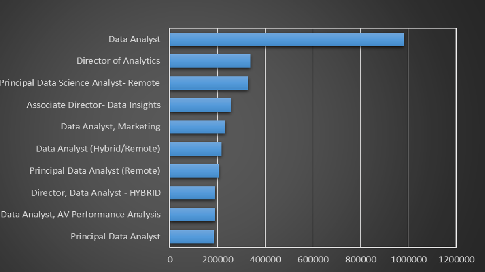
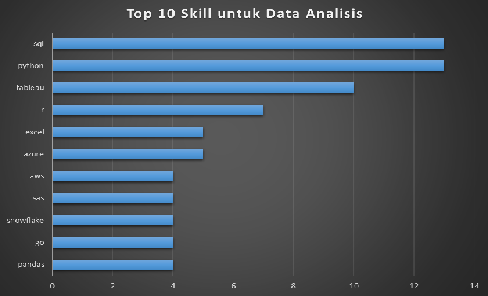

# Pengenalan
Project ini bertujuan sebagai gambaran bagaimana Data Analisis dalam meng-explore data seperti pekerjaan apa yang memiliki gaji tertinggi, skill yang dibutuhkan dalam pekerjaan tersebut dan pekerjaan mana yang banyak dicari dan juga memiliki gaji yang tinggi

SQL Queries [sql_query folder](/sql_query/)

# Latar Belakang

1. Apa pekerjaan data analis dengan gaji tertinggi?
2. Skill apa yang dibutuhkan untuk pekerjaan dengan gaji tertinggi ini?
3. Skill apa yang paling banyak dibutuhkan oleh data analis?
4. Skill mana yang terkait dengan gaji yang lebih tinggi?
5. Skill apa yang paling optimasl untuk dipelajari

# Alat yang Digunakan

Beberapa alat yang saya gunakan dalam project ini adalah :

- **SQL** : membantu query pada database dan mendapatkan Insights pada setiap data
- **PostgreSQL** : Database management System yang ideal dalam menange data
- **Visual Studio Code** :  Aplikasi untuk manajemen basis data dan menjalankan query sql
- **Git & Github** : Berbagi skrip SQL dan analisa yang saya buat di platform github


# Hasil Analisa
setiap pertanyaan untuk proyek ini bertujuan untuk menyelidiki aspek-aspek spesifik dari pasar kerja data analis. berikut ini adalah cara saya menjawab setiap pertanyaan:

### 1. Pekerjaan Data Analisis Dengan Gaji Tertinggi
Saya menyaring posisi Data Analisis berdasarkan gaji tahunan rata-rata dan lokasi dengan fokus pada pekerjaan jarak jauh. Query ini menyoroti peluang dengan gaji tinggi di bidang ini.

```sql
SELECT  
    job_id
    job_title
    job_location
    job_schedule_type
    salary_year_avg
    job_posted_date
    name AS company_name
FROM
    job_postings_fact 
LEFT JOIN company_dim on job_postings_fact.company_id = company_dim.company_id
WHERE
    job_title_short = 'Data Analyst' AND
    job_location = 'Anywhere' AND
    salary_year_avg is NOT NULL
ORDER BY
    salary_year_avg DESC
LIMIT 20
```
Berikut adalah rincian pekerjaan data analis teratas di tahun 2023:

- **Kisaran Gaji yang Luas**: 10 pekerjaan data analis dengan gaji tertinggi berkisar antara $184.000 hingga $650.000 yang mengindikasikan potensi gaji yang signifikan di bidang ini.
- **Perusahaan yang Beragam**: Perusahaan seperti SmartAsset Meta dan AT&T termasuk di antara mereka yang menawarkan gaji tinggi menunjukkan minat yang luas di berbagai industri.
- **Variasi Jabatan Pekerjaan**: Ada keragaman yang tinggi dalam jabatan pekerjaan dari Data Analis hingga Direktur Analisis yang mencerminkan beragam peran dan spesialisasi dalam analisis data.


*Grafik Top 10 rerata Gaji pertahun tertinggi untuk Data Analisis*

### 2. Skill Untuk Pekerjaan Dengan Gaji Tertinggi

Saya menggabungkan Data Job Posting dengan Data Skill untuk memberikan Insights tentang apa yang dinilai oleh pemberi kerja untuk pekerjaan dengan gaji tertinggi.
```sql
WITH top_paying_job AS (
    SELECT  
        job_id
        job_title
        job_posted_date
        salary_year_avg
        name AS company_name
    FROM
        job_postings_fact 
    LEFT JOIN company_dim on job_postings_fact.company_id = company_dim.company_id
    WHERE
        job_title_short = 'Data Analyst' AND
        job_location = 'Anywhere' AND
        salary_year_avg is NOT NULL
    ORDER BY
        salary_year_avg DESC
    LIMIT 20
)

SELECT 
    top_paying_job.*
    skills
FROM top_paying_job
INNER JOIN skills_job_dim ON top_paying_job.job_id = skills_job_dim.job_id
INNER JOIN skills_dim ON skills_job_dim.skill_id = skills_dim.skill_id
ORDER BY
    salary_year_avg DESC
```
Berikut adalah rincian skill yang paling dibutuhkan untuk 10 pekerjaan Data Analisis dengan gaji tertinggi di tahun 2023 :

- **SQL** Memimpin dengan 8 pencarian
- **Python** Posisi kedua adalah Python denga 7 pencarian
- **Tablue** Juga termasuk dengan yang banyak di cari di angka 6 


*Grafik Top 10 Skill yang banyak dibutuhkan Data Analisis*

### 3. Skill Yang Dibutuhkan Untuk Data Analisis

Query ini membantu mengidentifikasi skill yang paling sering diminta dalam lowongan pekerjaan mengarahkan fokus ke area dengan permintaan tinggi.
```sql
SELECT
    skills
    COUNT(skills_job_dim.job_id) AS demand_count
FROM Job_postings_fact
INNER JOIN skills_job_dim on Job_postings_fact.job_id = skills_job_dim.job_id
INNER JOIN skills_dim ON skills_job_dim.skill_id = skills_dim.skill_id
WHERE
    job_title_short = 'Data Analyst' AND
    job_work_from_home = TRUE
GROUP BY
    skills
ORDER BY
    demand_count DESC
limit 10
```
Berikut adalah rincian skill yang paling banyak dibutuhkan oleh Data Analis pada tahun 2023 :
- **SQL** dan **Excel** tetap menjadi hal yang fundamental, menekankan perlunya skill dasar yang kuat dalam pemrosesan data dan manipulasi spreadsheet.
- **Programming** dan **Visualisasi Data** seperti Python, Tableau, dan Power BI sangat penting, yang menunjukkan semakin pentingnya skill teknis dalam penceritaan data dan dukungan keputusan.

| Skills   | Demand Count |
|----------|--------------|
| SQL      | 7291         |
| Excel    | 4611         |
| Python   | 4330         |
| Tableau  | 3745         |
| Power BI | 2609         |
*Tabel Top 5 teratas permintaan skill untuk lowongan sebagai Data Analis*

### 4. Skill Berdasarkan Gaji
Menelusuri gaji rata-rata yang terkait dengan skill yang berbeda mengungkapkan skill mana yang memiliki gaji  tertinggi.
```sql
SELECT
    skills,
    ROUND(AVG(salary_year_avg),2) AS avg_salary_yearly
FROM Job_postings_fact
INNER JOIN skills_job_dim on Job_postings_fact.job_id = skills_job_dim.job_id
INNER JOIN skills_dim ON skills_job_dim.skill_id = skills_dim.skill_id
WHERE
    job_title_short = 'Data Analyst'
    AND salary_year_avg IS NOT NULL
    AND job_work_from_home = TRUE
GROUP BY
    skills
ORDER BY
    avg_salary_yearly DESC
limit 25;
```
Berikut ini adalah rincian hasil untuk skill dengan gaji tertinggi untuk Data Analis:
- **Permintaan Tinggi untuk Skill Big Data & ML:**
Gaji tertinggi dikuasai oleh analis yang terampil dalam teknologi big data (PySpark, Couchbase), Machine Learning (DataRobot, Jupyter), dan Python (Pandas, NumPy), yang mencerminkan penilaian tinggi industri terhadap pemrosesan data dan kemampuan pemodelan prediktif.
-  **Software Development & Deployment Proficiency:**
Pengetahuan dalam alat pengembangan dan penerapan (GitLab, Kubernetes, Airflow) menunjukkan persilangan yang menguntungkan antara analisis data dan teknik, dengan mengutamakan skill yang memfasilitasi otomatisasi dan manajemen data pipeline yang efisien.
- **Cloud Computing Expertise:**
Keakraban dengan alat bantu cloud dan rekayasa data (Elasticsearch, Databricks, GCP) menggarisbawahi semakin pentingnya lingkungan analitik berbasis cloud, yang menunjukkan bahwa kemahiran cloud secara signifikan meningkatkan potensi penghasilan dalam analitik data.


| Skills        | Average Salary ($) |
|---------------|-------------------:|
| pyspark       |            208,172 |
| bitbucket     |            189,155 |
| couchbase     |            160,515 |
| watson        |            160,515 |
| datarobot     |            155,486 |
| gitlab        |            154,500 |
| swift         |            153,750 |
| jupyter       |            152,777 |
| pandas        |            151,821 |
| elasticsearch |            145,000 |

*Tabel Top 10 skill dengan gaji tertinggi untuk Data Analis
*

### 5. Skill Paling Optimal Untuk Dipelajari

Menggabungkan insights dari data permintaan dan gaji, query ini bertujuan untuk menentukan skill yang banyak diminati dan memiliki gaji tinggi, menawarkan fokus strategis untuk pengembangan skill.
```sql
SELECT
    skills_dim.skill_id,
    skills_dim.skills,
    COUNT(skills_job_dim.job_id) AS demand_count,
    ROUND(AVG(Job_postings_fact.salary_year_avg), 2) AS avg_salary_yearly
FROM Job_postings_fact
INNER JOIN skills_job_dim on Job_postings_fact.job_id = skills_job_dim.job_id
INNER JOIN skills_dim on skills_job_dim.skill_id = skills_dim.skill_id
WHERE
    job_title_short = 'Data Analyst'
    AND salary_year_avg IS NOT NULL
    AND job_work_from_home = TRUE
GROUP BY
    skills_dim.skill_id
having
    COUNT(skills_job_dim.job_id) > 10
ORDER BY
    avg_salary_yearly DESC,
    demand_count DESC
limit 25;
```

| Skill ID | Skills     | Demand Count | Average Salary ($) |
|----------|------------|--------------|-------------------:|
| 8        | go         | 27           |            115,320 |
| 234      | confluence | 11           |            114,210 |
| 97       | hadoop     | 22           |            113,193 |
| 80       | snowflake  | 37           |            112,948 |
| 74       | azure      | 34           |            111,225 |
| 77       | bigquery   | 13           |            109,654 |
| 76       | aws        | 32           |            108,317 |
| 4        | java       | 17           |            106,906 |
| 194      | ssis       | 12           |            106,683 |
| 233      | jira       | 20           |            104,918 |

*Tabel skill yang paling optimal untuk data analis yang diurutkan berdasarkan gaji
*

Berikut adalah rincian skill yang paling optimal untuk Data Analis pada tahun 2023: 
- **Bahasa Pemrograman dengan Permintaan Tinggi:** Python dan R menonjol karena permintaannya yang tinggi, dengan jumlah permintaan masing-masing 236 dan 148. Meskipun permintaannya tinggi, gaji rata-rata mereka sekitar $101.397 untuk Python dan $100.499 untuk R, yang menunjukkan bahwa kemahiran dalam bahasa-bahasa ini sangat dihargai tetapi juga tersedia secara luas.
-  **Teknologi Cloud:** Skill dalam teknologi khusus seperti Snowflake, Azure, AWS, dan BigQuery menunjukkan permintaan yang signifikan dengan gaji rata-rata yang relatif tinggi, yang menunjukkan semakin pentingnya platform cloud dan teknologi Big Datar dalam analisis data.
- **Business Intelligence dan Visualisasi Data:** Tableau dan Looker, dengan jumlah permintaan masing-masing 230 dan 49, serta gaji rata-rata sekitar $99.288 dan $103.795, menyoroti peran penting visualisasi data dan intelijen bisnis dalam memperoleh insights yang dapat ditindaklanjuti dari data.
- **Teknologi Basis Data:** Permintaan akan keahlian dalam basis data tradisional dan NoSQL (Oracle, SQL Server, NoSQL) dengan gaji rata-rata berkisar antara $97.786 hingga $104.534, mencerminkan kebutuhan yang terus meningkat akan keahlian dalam penyimpanan data, pencarian data, dan manajemen.

